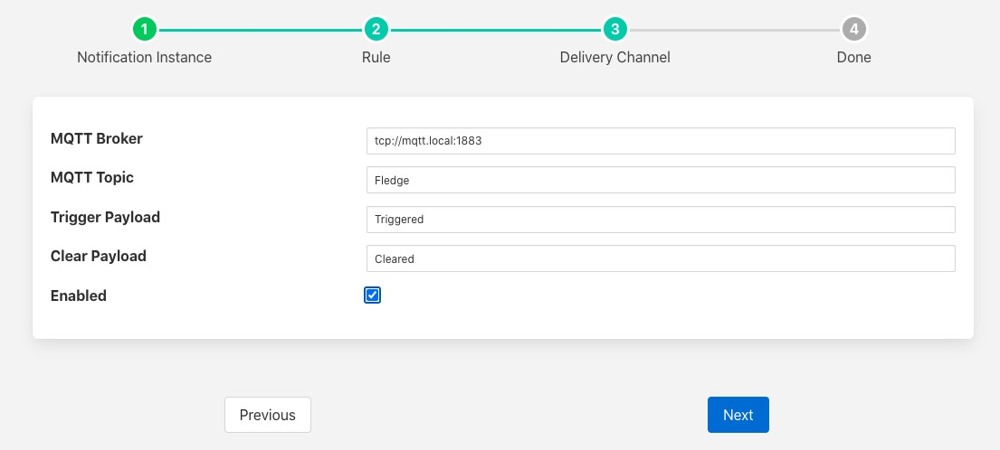

.. Images

MQTT Notification
=================

The *fledge-notify-mqtt* notification delivery plugin sends notifications via an MQTT broker. The MQTT topic and the payloads to send when the notificstion triggers or is cleared are configurable.

Once you have created your notification rule and move on to the delivery mechanism

  - Select the mqtt plugin from the list of plugins

  - Click *Next*

    +----------+
    | |mqtt_1| |
    +----------+

  - Configure the plugin

    - **MQTT Broker**: The URL of your MQTT broker.

    - **Topic**: The MQTT topic on which to publish the messages.

    - **Trigger Payload**: The payload to send when the notification triggers

    - **Clear Payload**: The payload to send when the notification clears

  - Enable the plugin and click *Next*

  - Complete your notification setup

